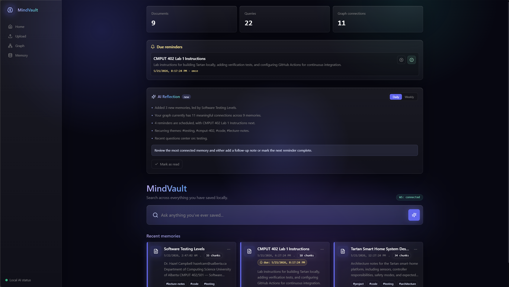
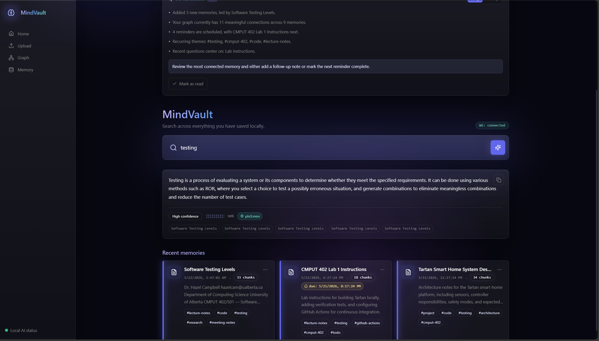
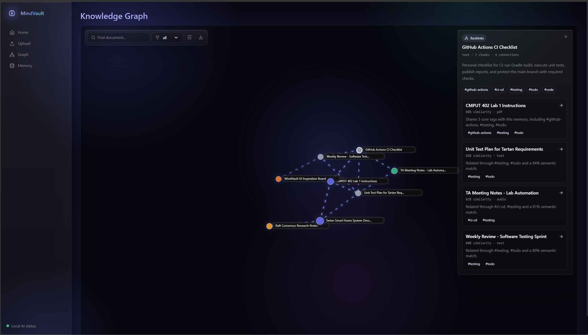
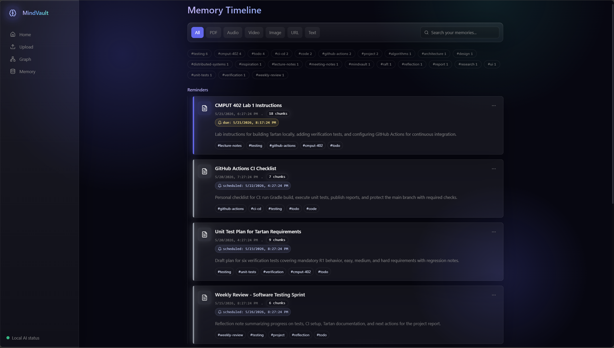
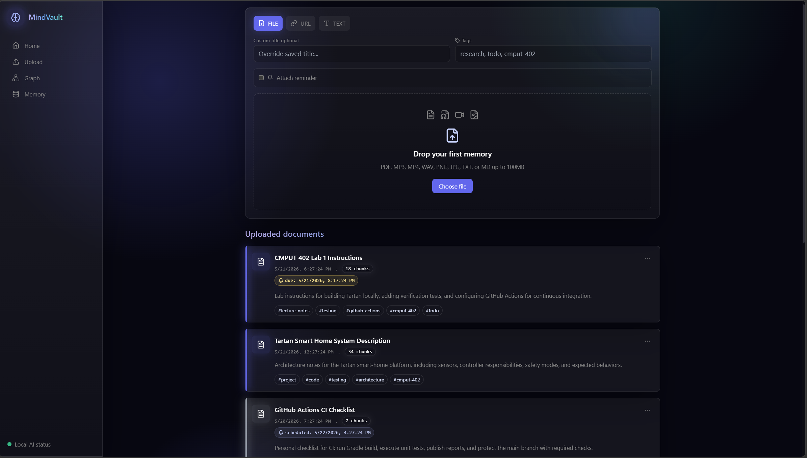
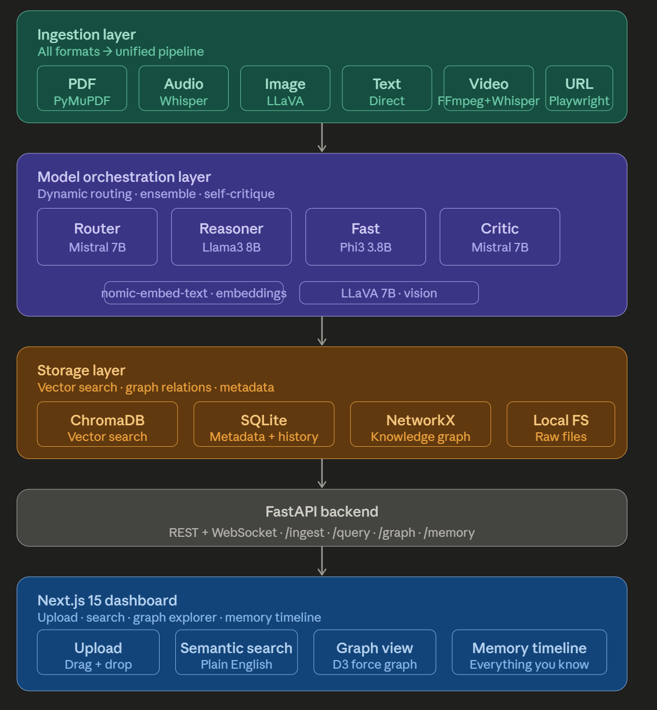

<div align="center">

# MindVault

### Your Second Brain. Entirely Yours.

*Capture anything · Connect everything · Query privately*

[](https://www.python.org/)
[](https://fastapi.tiangolo.com/)
[](https://nextjs.org/)
[](https://www.typescriptlang.org/)
[](https://ollama.com/)
[](https://www.trychroma.com/)
[](https://www.docker.com/)
> **No API keys. No cloud. No subscriptions. No data leaving your machine.**

</div>

---

## What Is MindVault?

MindVault is a **fully local, privacy-first AI second brain**. Drop in your notes, PDFs, lecture recordings, research papers, URLs, images, or videos — and MindVault transforms them into a searchable, connected, queryable knowledge system powered entirely by local AI models through Ollama.

Ask anything you've ever saved. Watch your ideas connect into a living knowledge graph. Get AI-synthesized answers with sources and confidence scores — all without a single byte leaving your machine.

Built for **students, researchers, developers, and knowledge workers** who refuse to trade privacy for intelligence.

---

## Screenshots

| | |
|---|---|
|  |  |
| **Home** — Stats, AI Reflection digest, due reminders, recent memory cards | **Query** — Streaming answers, confidence scores, clickable source previews |
|  |  |
| **Knowledge Graph** — D3 force graph, semantic backlinks, relationship explanations | **Memory Timeline** — Tag filters, reminder cards, type filters |


*Upload — Drag-and-drop files, URLs, or manual titled notes with tags and reminders*

---

## Features

| | |
|---|---|
| **Query Your Knowledge Base** | Ask in plain English across everything you've saved. MindVault routes to the right local model, retrieves relevant chunks, synthesizes an answer, critiques it, and streams it back with confidence scores and source previews. |
| **Living Knowledge Graph** | Every new memory is compared against existing ones. Strong semantic matches become edges in an interactive D3 force graph. Click any node for a backlink panel with similarity scores, shared tags, and relationship explanations. |
| **Ingest Anything** | PDFs, MP3s, MP4s, images, markdown, plain text, and URLs. Whisper transcribes audio, LLaVA understands images, Playwright scrapes pages, PyMuPDF extracts PDFs — chunked, embedded, tagged, and stored automatically. |
| **Smart Reminders** | Attach once, daily, or weekly reminders to any memory at upload time or later. Due reminders surface on the home dashboard with dismiss and reschedule controls. |
| **Auto-Generated Tags** | Local AI suggests tags for every memory. Editable, filterable on the timeline, and used to strengthen graph connections between related memories. |
| **AI Reflection Digest** | A locally-generated daily or weekly digest covers new memories, graph growth, recurring themes, upcoming reminders, and a suggested next action. Updated on demand. Never sent anywhere. |
 
---

---

## Architecture



---

## Tech Stack

| Layer | Technology |
|---|---|
| **Backend** | Python 3.12, FastAPI, WebSockets, Pydantic |
| **Local AI Runtime** | Ollama |
| **Models** | Mistral 7B, Llama3 8B, Phi3 Mini, LLaVA 7B, nomic-embed-text |
| **Transcription** | openai-whisper (local) |
| **Vector Store** | ChromaDB |
| **Metadata Store** | SQLite with aiosqlite |
| **Knowledge Graph** | NetworkX (persisted to JSON) |
| **Ingestion** | PyMuPDF, Playwright, Pillow, FFmpeg |
| **Frontend** | Next.js 15 App Router, TypeScript, Tailwind CSS |
| **Graph Visualization** | D3.js force-directed simulation |
| **Infrastructure** | Docker, Docker Compose |

---

## Local AI Model Roles

| Model | Role |
|---|---|
| `nomic-embed-text` | Semantic embeddings for vector search and graph connections |
| `phi3:mini` | Fast lightweight answers and tag suggestions |
| `mistral:7b` | Query routing and answer critique |
| `llama3:8b` | Deep multi-source synthesis and reasoning |
| `llava:7b` | Image understanding and visual Q&A |
| `whisper base` | Local audio and video transcription |

---

## Supported Input Formats

| Format | Extensions | Processing |
|---|---|---|
| **PDF** | `.pdf` | Text extraction, page chunking, embedded image analysis |
| **Audio** | `.mp3`, `.wav` | Whisper transcription with segments |
| **Video** | `.mp4` | FFmpeg audio extraction + thumbnails + Whisper transcription |
| **Image** | `.png`, `.jpg`, `.jpeg` | Pillow metadata + LLaVA visual description |
| **Text** | `.txt`, `.md`, pasted notes | Chunking, embeddings, tags, optional reminder |
| **URL** | `https://...` | Playwright scraping + screenshot |

---

## Prerequisites

- Python 3.11+ (3.12 recommended)
- Node.js + npm
- [Ollama](https://ollama.com) installed locally
- FFmpeg for audio/video processing
- ~15 GB disk space for the full local model set

---

## Quick Start

### 1 — Pull Ollama models

```bash
ollama pull nomic-embed-text
ollama pull phi3:mini
ollama pull mistral:7b
ollama pull llama3:8b
ollama pull llava:7b
```

### 2 — Start the backend

```powershell
cd mindvault/backend
python -m venv venv
venv\Scripts\activate
pip install --upgrade pip "setuptools<82" wheel
pip install -r requirements.txt
python -m playwright install chromium
python -m uvicorn main:app --port 8000
```

Verify:
```powershell
Invoke-WebRequest -UseBasicParsing http://127.0.0.1:8000/health
```

### 3 — Start the frontend

```powershell
cd mindvault/frontend
npm install
npm run dev
```

Open **http://localhost:3000**

### Or: Docker Compose

```bash
docker compose up --build
```

| Service | Purpose | Port |
|---|---|---|
| `ollama` | Local model runtime | `11434` |
| `backend` | FastAPI + ingestion pipeline | `8000` |
| `frontend` | Next.js dashboard | `3000` |

---

## Demo Dataset

Explore all features without uploading real data:

```powershell
cd mindvault
backend\venv\Scripts\python.exe scripts\seed_demo_data.py
```

Restart the backend afterward so the graph reloads. The demo populates due reminders, digest content, tag clusters, graph connections, backlinks, and query history.

---

## API Reference

| Method | Endpoint | Description |
|---|---|---|
| `GET` | `/health` | Service status, models, document count |
| `POST` | `/ingest` | Upload file, URL, or titled text note |
| `GET` | `/ingest/documents` | List all ingested documents |
| `DELETE` | `/ingest/{document_id}` | Delete from vector store, SQLite, and graph |
| `POST` | `/query` | Query the vault (supports SSE streaming) |
| `GET` | `/graph` | D3-compatible graph with enriched metadata |
| `GET` | `/memory` | Memory timeline documents |
| `GET` | `/memory/tags` | Tag counts for filtering |
| `PUT` | `/memory/{id}/tags` | Update memory tags |
| `GET` | `/memory/reminders/due` | Fetch due reminders |
| `POST` | `/memory/{id}/reminder/dismiss` | Dismiss or reschedule a reminder |
| `POST` | `/memory/{id}/reminder/complete` | Mark a reminder complete |
| `GET` | `/memory/digest?period=daily` | AI reflection digest (daily or weekly) |
| `POST` | `/memory/digest/read` | Mark digest as read |
| `GET` | `/memory/history` | Recent query history |
| `WS` | `/ws` | Live streaming answer channel |

---

## Privacy Model

MindVault is local-first by design:

- ✅ No external AI APIs — all inference runs through local Ollama models
- ✅ No cloud database — vectors, metadata, and graph stay on disk
- ✅ No hosted vector store — ChromaDB runs in-process locally
- ✅ No telemetry — no usage data collected or transmitted
- ✅ Files, embeddings, reminders, and query history never leave your machine
- ✅ Only network dependency is your local Ollama server on `127.0.0.1`

---

## Project Structure

```
mindvault/
├── backend/           FastAPI app, ingestion pipeline, storage, orchestration
├── frontend/          Next.js 15 UI and D3 graph explorer
├── models/            Ollama model pull script
├── scripts/           Setup, testing, and demo seed utilities
├── storage/           Local persistent app data (gitignored)
├── docs/              Architecture diagram and screenshots
└── docker-compose.yml
```

---

## Development

Backend compile check:
```powershell
backend\venv\Scripts\python.exe -m compileall backend
```

Frontend type and build checks:
```powershell
cd frontend
npx tsc --noEmit
npm run build
```

<div align="center">
<sub><em>Built for people who take their knowledge seriously — and their privacy even more so.</em></sub>
</div>